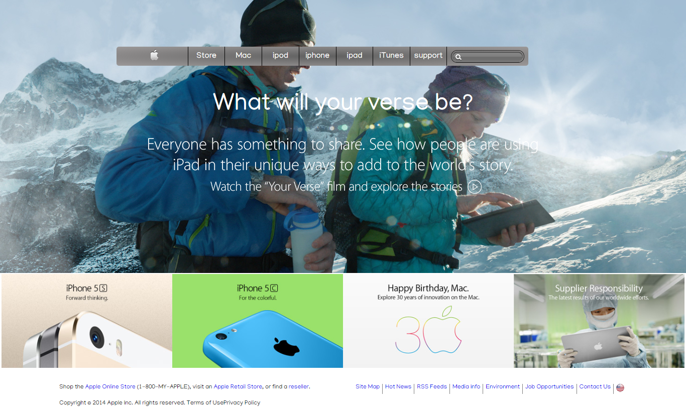

# Old Apple.com Clone

> This project was to clone the apple.com page and is part of the Background and Gradient in the Microverse Curriculum.

This project contains the following features:

1. Header with background gradient
2. Background image
3. Grid images

## Built With

- HTML5 and CSS
- Font awesome

## Live Demo

[Live Demo Link](https://raw.githack.com/hillarioh/Apple.com-clone/appleBranch/index.html)

## Author

- Github: [@Hillarioh](https://github.com/hillarioh)

## 🤝 Contributing

Contributions, issues and feature requests are welcome!

Feel free to check the [issues page](https://github.com/hillarioh/Apple.com-clone/issues).

## Show your support

Give a ⭐️ if you like this project!

## 📝 License

This project is [MIT](lic.url) licensed.
